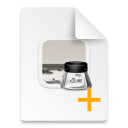

# workflows
This is a collection of my public Alfred Workflows.

## Requirements: 
 - macOS with [Alfred 4.+](https://www.alfredapp.com) Powerpack Licence.
 - Some workflows use python3 scripts, so they require macOS Version 10+ or separately installed python3 (anaconda, homebrew, macports).  

## The Workflows
<table><caption><small>Generated at 2022-07-11</small></caption><table><tr><th><th>Workflow<th>Version<th>contains
<tr>
<td>
<td><strong>alarmclock</strong> &nbsp;&nbsp;&nbsp;&nbsp;alarmclock using launchd &nbsp;&nbsp;&nbsp;&nbsp;&nbsp;&nbsp;&nbsp;&nbsp;&nbsp;&nbsp;&nbsp;&nbsp;<a href="doc/alarmclock.md">Read more...</a>
<td>1.1.1
<td>action.script : 4 input.keyword : 2 output.largetype : 1 output.notification : 1 trigger.external : 3
<tr>
<td>
<td><strong>createfile</strong> &nbsp;&nbsp;&nbsp;&nbsp;Create File in selected Folder or current Folder &nbsp;&nbsp;&nbsp;&nbsp;&nbsp;&nbsp;&nbsp;&nbsp;&nbsp;&nbsp;&nbsp;&nbsp;<a href="doc/createfile.md">Read more...</a>
<td>1.1.1
<td>action.browseinalfred : 1 action.script : 2 input.keyword : 1 input.scriptfilter : 1 output.notification : 1 trigger.action : 2 utility.argument : 3
<tr>
<td>
<td><strong>createfolder</strong> &nbsp;&nbsp;&nbsp;&nbsp;Two File Actions to create Folder in selected Folder or in current Folder.
<td>1.1.2
<td>action.browseinalfred : 1 action.script : 2 input.keyword : 1 output.notification : 1 trigger.action : 2 utility.argument : 1
<tr>
<td>
<td><strong>fileref</strong> &nbsp;&nbsp;&nbsp;&nbsp;Generate/Follow File Reference
<td>0.0.9
<td>action.actioninalfred : 1 action.script : 2 trigger.action : 1 trigger.external : 1
<tr>
<td>
<td><strong>frontmostdoc</strong> &nbsp;&nbsp;&nbsp;&nbsp;Show frontmost document's file of frontmost application &nbsp;&nbsp;&nbsp;&nbsp;&nbsp;&nbsp;&nbsp;&nbsp;&nbsp;&nbsp;&nbsp;&nbsp;<a href="doc/frontmostdoc.md">Read more...</a>
<td>1.2.1
<td>action.actioninalfred : 1 action.script : 2 input.keyword : 1 output.playsound : 1 trigger.hotkey : 1 utility.argument : 1 utility.conditional : 1 utility.transform : 1
<tr>
<td>
<td><strong>Going with alt</strong> &nbsp;&nbsp;&nbsp;&nbsp;Safari alt-hot keys
<td>1.0.1
<td>action.script : 2 trigger.hotkey : 3 utility.argument : 1
<tr>
<td>
<td><strong>gosafari</strong> &nbsp;&nbsp;&nbsp;&nbsp;open list of tabs &nbsp;&nbsp;&nbsp;&nbsp;&nbsp;&nbsp;&nbsp;&nbsp;&nbsp;&nbsp;&nbsp;&nbsp;<a href="doc/gosafari.md">Read more...</a>
<td>1.4.0
<td>action.browseinalfred : 1 action.script : 2 input.keyword : 1 input.listfilter : 1 input.scriptfilter : 2 output.callexternaltrigger : 5 output.writefile : 1 trigger.external : 5 trigger.hotkey : 1 utility.argument : 3 utility.conditional : 2
<tr>
<td>
<td><strong>mdhelper</strong> &nbsp;&nbsp;&nbsp;&nbsp;Markdown Helper
<td>1.0.2
<td>action.script : 1 input.listfilter : 1 output.clipboard : 1 trigger.hotkey : 4 trigger.universalaction : 1 utility.argument : 4 utility.junction : 1
<tr>
<td>
<td><strong>TMUX</strong> &nbsp;&nbsp;&nbsp;&nbsp;Attach to TMUX &nbsp;&nbsp;&nbsp;&nbsp;&nbsp;&nbsp;&nbsp;&nbsp;&nbsp;&nbsp;&nbsp;&nbsp;<a href="doc/TMUX.md">Read more...</a>
<td>1.0.2
<td>action.applescript : 1 action.script : 1 action.terminalcommand : 1 input.keyword : 1 utility.conditional : 1
<tr>
<td>
<td><strong>unmount</strong> &nbsp;&nbsp;&nbsp;&nbsp;unmount &nbsp;&nbsp;&nbsp;&nbsp;&nbsp;&nbsp;&nbsp;&nbsp;&nbsp;&nbsp;&nbsp;&nbsp;<a href="doc/unmount.md">Read more...</a>
<td>1.2.0
<td>action.script : 3 input.scriptfilter : 2 output.largetype : 1 output.notification : 1
<tr>
<td>
<td><strong>vimtool</strong> &nbsp;&nbsp;&nbsp;&nbsp;Start vim as File Action, Universal Text Action or with Keyword in Terminal
<td>1.2.3
<td>action.script : 2 action.terminalcommand : 2 input.keyword : 1 output.clipboard : 1 trigger.action : 1 trigger.universalaction : 1</table>

## Installation

After download of `file'.alfredworkflow do a fearless doubleclick. Alfred will open it and ask to install it.
